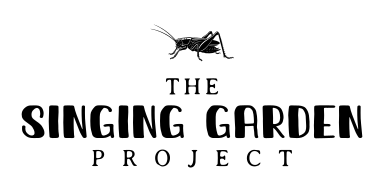

# TheSingingGardenProject
The Singing Garden Project is a citizen science research investigation that aims to better understand the trills of the Gryllus Integer. The presented work is for analyzing the audio files recorded of the trills.
